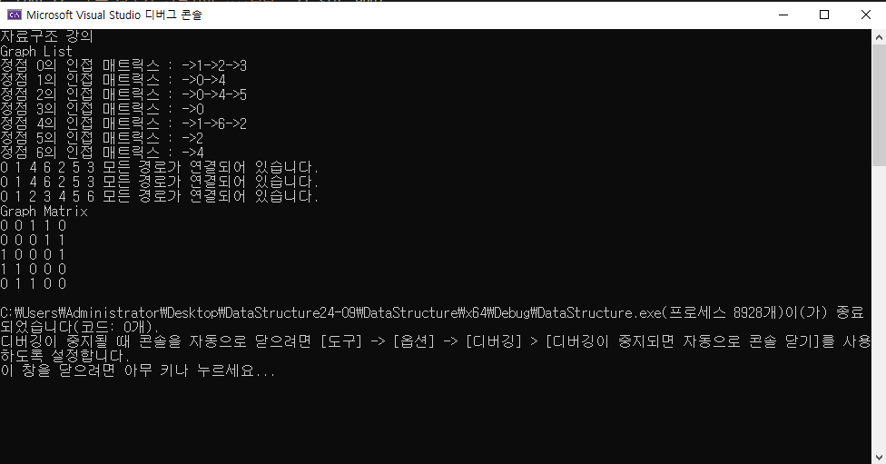

# DataStructure24-09

## 자료구조의 종류

 

## 설명
- 자료구조를 이해하고 구현하는 저장소

|자료구조| 장점 | 단점 | 사용예시 | 이미지 |
| -------- | ------ | ------ | -------------------- | ------ |
| vector | 빠른 임의 접근  끝에서 빠른 삽입/삭제 | 중간 삽입/삭제 느림   크기 조정 시 비용 큼 | 아이템 목록 리스트   인벤토리 아이템 | ------ |
| List   | 빠른 삽입/삭제(어디서든)   메모리 사용이 효율적 | 임의 접근이 느림 | 큐(Queue)구현   AI행동 목록 | ------ |
| Deque  | 양쪽에서 빠른 데이터 삽입/삭제   vector장점을 그대로 갖음 | vector보다 메모르 소모가 큼   vector단점을 그대로 갖음 | (명령어)히스토리 기능 구현 | ------ |
| Set    | 빠른 검색/삽입   자동 정렬   중복 허용(X) | 추가 메모리 사용 | 단일 아이템 구현(Unique) | ------ |
| MultiSet | set과 동일하지만 중복 허용 | set과 동일 | 아이템 드랍 테이블 | ------ |
| Map    | pair 클래스를 이용해서 key와 value로 빠른 검색 사용 가능 | 삽입/삭제 시 rebuilding 시간 소모 | 게임 설정 저장 구현 | ------ |
| Unordered set/map | hash로 구현한 자료구조, 매우 빠른 검색 | 정렬되지 않은 상태   추가 메모리 사용 | 게임에서 빠르게 검색이 필요한 경우에 대부분 사용 | ------ |
| Graph  | 복잡한 관계를 표현할 수 있음 | 구현이 복잡 | 네비게이션(Navi) - 길찾기   AI Behaviour Tree | ------ | 
